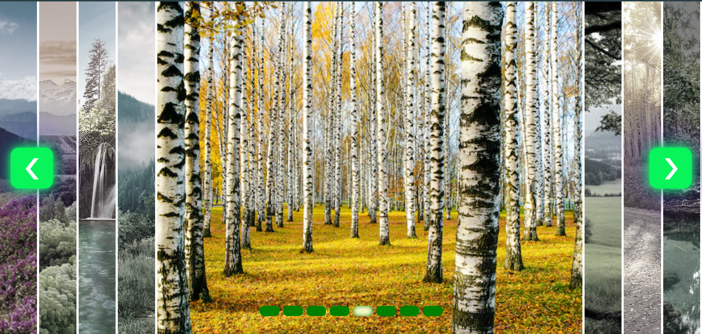

Click list slider

Preview 

I used HTML, JS, CSS. You can change the image with left and right buttons or radio buttons. And when you look at the current image the other images will be gray and smaller. 

I used JS events for that
